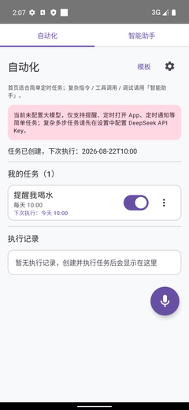
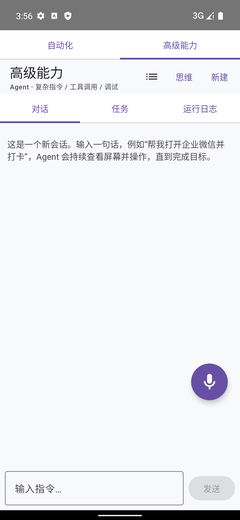
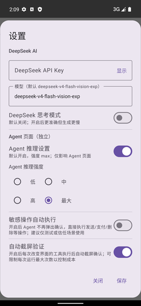
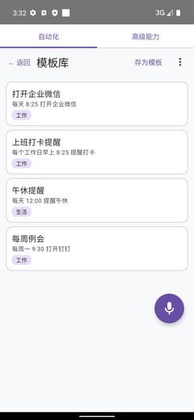

# VoiceConfig（言控）

> 用自然语言/语音，在 Android 手机上可靠创建和执行自动化任务；内置多模态 Agent，可以“看懂屏幕、操作 App、验证结果”。

VoiceConfig（言控）是一个 Android Jetpack Compose 应用。它不只是提醒工具，更是一个**可验证的手机自动化 Agent**：

- 用中文自然语言创建定时、周期、条件自动化任务；
- 通过 DeepSeek 多模态 Agent 执行多步、跨 App 操作；
- 支持 Shizuku 高级自动打开 App；
- 提供会话历史、任务记录、运行日志和 Agent 工具调用回放。

## 界面截图

| 首页 | Agent 对话 | 设置 | 模板库 |
| --- | --- | --- | --- |
|  |  |  |  |

## 工作原理

```text
用户一句话 / 一段语音
        │
        ▼
自然语言解析（本地规则 + DeepSeek 理解）
        │
        ├── 简单任务：创建定时 / 条件触发
        └── 复杂任务：进入 Agent 多轮会话
                         │
                         ▼
                规划步骤 → 感知屏幕 → 调用工具 → 验证结果
                         │
                         ▼
                执行记录 / 会话历史 / 轨迹回放
```

VoiceConfig 不是“只会聊天”的助手，而是把语言理解、手机操作、结果验证串成闭环：

```text
理解意图 → 可执行步骤 → 安全工具调用 → 验证 → 反馈
```

## 核心能力

### 1. 自然语言创建自动化任务

- 支持中文自然语言解析
- 时间表达：
  - `每天 8:25`
  - `每个工作日 08:57`
  - `每周一 9:30`
  - `明天 18:00`
  - `每隔 2 小时`
- 自动识别 App 别名并解析包名
- 未识别时支持手动填写包名 / Deep Link
- 会自动学习并持久化用户自定义别名

### 2. 定时与条件触发

- AlarmManager 调度
- 开机 / 服务启动后自动恢复闹钟
- 支持条件触发：
  - Wi-Fi
  - 电量
  - 位置接近
- 支持任务启停、立即执行、复制、删除
- 显示下次执行时间

### 3. 多模态 Agent

- 多轮工具调用
- 结构化屏幕感知：UI 树 + 截图 + 坐标 + 分辨率
- 截图 + 坐标网格视觉定位
- UI 树读取
- 点击前复核
- 文字点击
- 实时消息持久化
- 思维链可视化
- Agent 轨迹日志与截图留存
- 执行步骤时间线：实时展示正在执行/成功/失败/被拒绝的工具步骤
- 敏感操作确认，默认需用户允许；可开启自动模式

### 4. 执行通道

| 通道 | 说明 |
|---|---|
| 通知提醒 | 默认降级通道 |
| Deep Link | 直接打开指定页面 |
| Shizuku | 高级自动打开 App |
| Agent 工具链 | 读屏、点击、输入、验证 |

### 5. 本地优先与隐私

- 本地数据库：任务、会话、执行记录、模板
- 本地 ASR：支持离线语音识别模型
- API Key 仅保存在应用本地
- 构建产物、本地调试数据、内部文档默认不进入 Git

## Agent 工具清单

| 工具 | 说明 |
|---|---|
| `open_app` | 打开 App / Deep Link |
| `find_app` | 按中文名或关键字查找已安装 App |
| `get_screen_state` | 一次获取 UI 树、截图、坐标和分辨率 |
| `read_screen` | 截屏并返回带坐标网格的视觉信息 |
| `read_ui` | 读取当前界面 UI 树与组件坐标 |
| `tap` | 按坐标点击 |
| `tap_text` | 按文字/多个候选文字点击 |
| `review_tap` | 点击前在截图上标出拟定坐标供复核 |
| `input_text` | 输入文本 |
| `press_key` | 按键 / keycode |
| `swipe` | 滑动 |
| `wait` | 等待 |
| `run_shell` | 执行受限 shell 命令 |
| `web_search` | DeepSeek 联网搜索 |
| `file_read` | 读取文件 |
| `file_write` | 写入文件 |
| `clipboard_read` | 读取剪贴板 |
| `logcat_read` | 读取系统日志 |
| `notify` | 发送通知 |
| `open_file` | 打开文件/产物 |

## 技术架构

```text
app
 ├── MainActivity / Compose UI
 ├── Agent（AgentSession + Tool Calling + Vision）
 ├── AI（DeepSeek API、ASR、模型管理）
 ├── Scheduler（Alarm、条件触发）
 ├── Executor（通知、Deep Link、Shizuku）
 └── data:local（Room 本地存储）

core:
 ├── model     领域模型
 ├── nlp       本地自然语言解析
 ├── scheduler 调度与下次执行时间
 └── executor  执行引擎抽象
```

## 界面设计

- Material 3 + Jetpack Compose
- 支持深色模式
- 首页：任务列表 + 模板库 + 执行记录
- Agent 页面：对话 / 任务 / 运行日志
- 首页创建面板默认收起，悬浮麦克风为主要语音入口
- Agent 会话历史支持分组、重命名、删除、清空
- 设置页：
  - DeepSeek API Key 隐藏/显示
  - 模型选择
  - DeepSeek 思考模式
  - Agent 独立思维链与思考强度
  - 开发者调试折叠
- 模板库：
  - 分类 Chip
  - 存为模板 / 管理 / 导入导出

## 快速开始

### 1. 构建 APK

```bash
./gradlew :app:assembleDebug
```

APK 输出：

```text
app/build/outputs/apk/debug/app-debug.apk
```

### 2. 安装到手机

```bash
adb install -r app/build/outputs/apk/debug/app-debug.apk
```

### 3. 配置 DeepSeek API Key

打开 App → 设置 → 填写 DeepSeek API Key。

> 仓库不包含任何 API Key，密钥只保存在应用本地。

### 4. 启用 Shizuku 高级模式（可选）

1. 安装 [Shizuku](https://shizuku.rikka.app/) 并通过 ADB 或 root 启动。
2. 在 Shizuku 中授权“言控”。
3. 在 App 的“权限体检”中确认 Shizuku 状态为 ✅。

之后，“打开 App”类任务会优先通过 Shizuku 自动打开。

## 开发与测试

```bash
./gradlew :core:nlp:test
./gradlew :core:scheduler:test
./gradlew :core:executor:test
./gradlew :data:local:testDebugUnitTest
./gradlew :app:testDebugUnitTest
./gradlew :app:assembleDebug
```

模拟器或真机冒烟测试：

```bash
scripts/emulator_smoke.sh emulator-5554
python scripts/smoke_test.py emulator-5554
```

Agent 场景回放 / 评测：

```bash
# 运行单个场景
python scripts/agent_scenario_eval.py --serial emulator-5554 run --text "帮我打开设置"

# 运行一组场景
python scripts/agent_scenario_eval.py --serial emulator-5554 suite --scenarios scripts/scenarios.example.json

# 从设备拉取并分析 trace
python scripts/agent_scenario_eval.py --serial emulator-5554 pull --analyze
```

无线真机调试连接：

```bash
scripts/adb_connect.sh 192.168.1.100 42889
```

## 项目结构

```text
.
├── app/                 Android 应用入口、Compose UI、Agent
├── core/
│   ├── model/           领域模型
│   ├── nlp/             自然语言解析
│   ├── scheduler/       调度与下次执行时间
│   └── executor/        执行引擎抽象
├── data/
│   └── local/           Room 数据库与 Repository
├── scripts/             开发/测试脚本
├── screenshots/         README 界面截图
└── LICENSE              MIT License
```

## 当前路线

- [x] 任务列表、模板、执行历史
- [x] Shizuku 高级自动打开
- [x] 独立 Agent 页面、多轮会话、工具调用
- [x] 多模态截图理解、坐标网格、复核点击
- [x] 真机多步 App 操作验证
- [x] 屏幕感知包（UI 树 + 截图 + 坐标，结构化基础版）
- [x] 代码级敏感操作安全策略（默认确认 + 可开启自动模式）
- [x] 场景 Replay / 自动化评测框架（scripts/agent_scenario_eval.py）
- [ ] 悬浮球与连续语音
- [ ] 技能库与分享市场

## 安全与隐私

- 提交到仓库的内容不包含 API Key、ADB 私钥等敏感信息。
- 本地仿真器数据、构建产物、测试语音、内部规划文档默认通过 `.gitignore` 排除。
- Agent 屏幕截图和轨迹默认保存在应用私有目录，用于调试和回放。
- 内部产品文档、商业规划、用户测试数据不会包含在该开源仓库中。

## License

本项目使用 [MIT License](LICENSE)。
