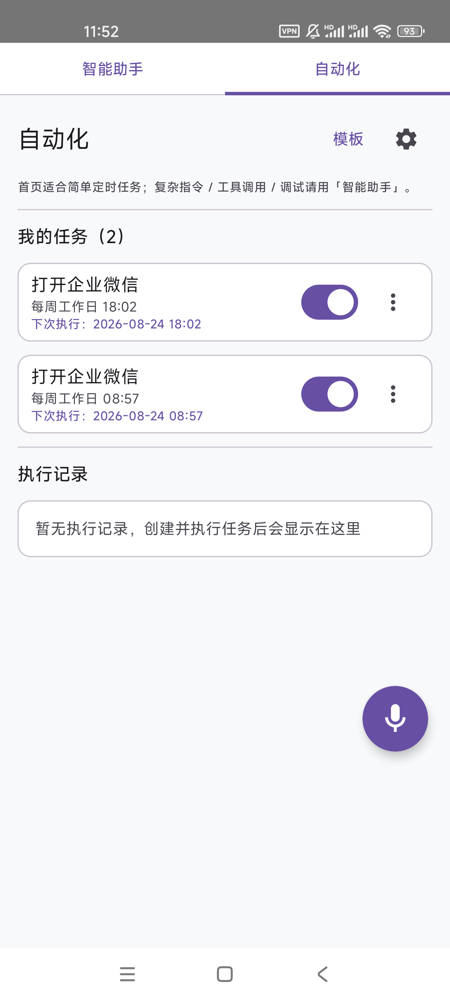
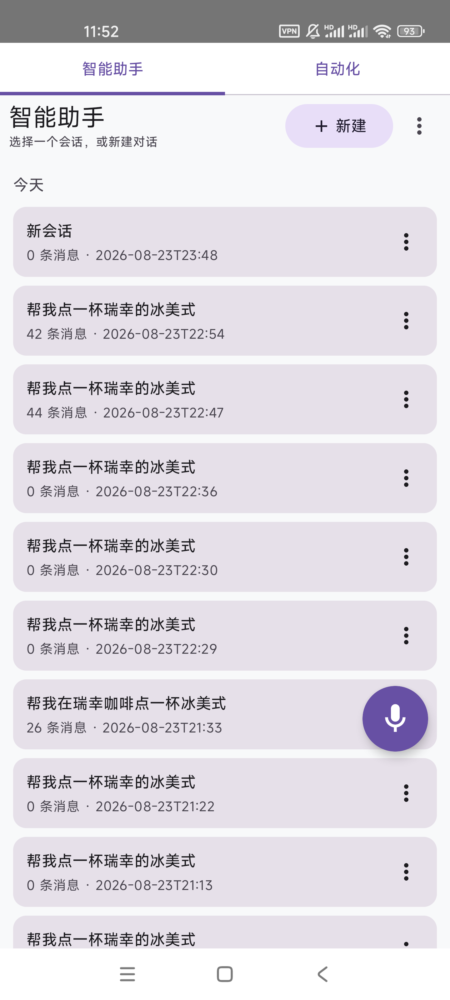
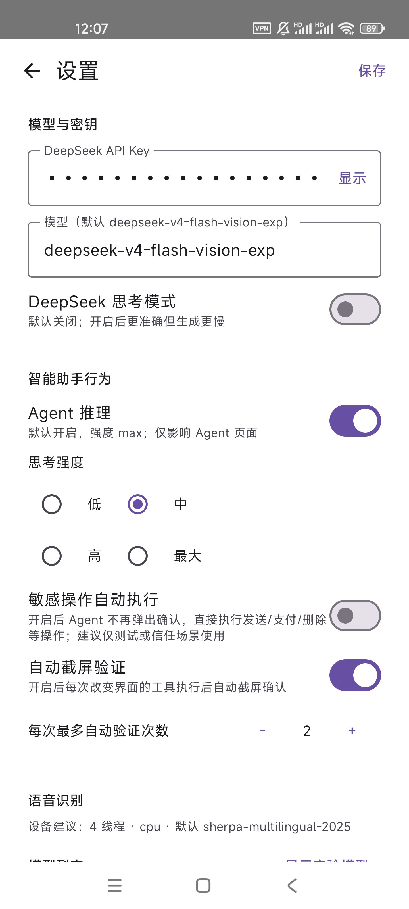
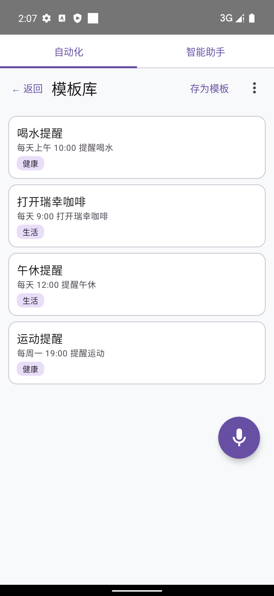

# VoiceConfig（言控）

> 用自然语言/语音，在 Android 手机上可靠创建和执行自动化任务；内置多模态 Agent，可以“看懂屏幕、操作 App、验证结果”。

VoiceConfig（言控）是一个 Android Jetpack Compose 应用。它不只是提醒工具，更是一个**可验证的手机自动化 Agent**：

- 用中文自然语言创建定时、周期、条件自动化任务；
- 通过 DeepSeek 多模态 Agent 执行多步、跨 App 操作；
- 支持 Shizuku 高级自动打开 App；
- 提供会话历史、任务记录、运行日志和 Agent 工具调用回放。

## 界面截图

| 自动化 | 智能助手 | 设置 | 模板库 |
| --- | --- | --- | --- |
|  |  |  |  |

## 工作原理

```text
用户一句话 / 一段语音
        │
        ▼
自然语言解析（本地规则 + DeepSeek 理解）
        │
        ├── 简单任务：创建定时 / 条件触发
        └── 复杂任务：进入 Agent 多轮会话
                         │
                         ▼
                规划步骤 → 感知屏幕 → 调用工具 → 验证结果
                         │
                         ▼
                执行记录 / 会话历史 / 轨迹回放
```

VoiceConfig 不是“只会聊天”的助手，而是把语言理解、手机操作、结果验证串成闭环：

```text
理解意图 → 可执行步骤 → 安全工具调用 → 验证 → 反馈
```

## 核心能力

### 1. 自然语言创建自动化任务

- 支持中文自然语言解析
- 时间表达：
  - `每天 8:25`
  - `每个工作日 08:57`
  - `每周一 9:30`
  - `明天 18:00`
  - `每隔 2 小时`
- 自动识别 App 别名并解析包名
- 未识别时支持手动填写包名 / Deep Link
- 会自动学习并持久化用户自定义别名

### 2. 定时与条件触发

- AlarmManager 调度
- 开机 / 服务启动后自动恢复闹钟
- 支持条件触发：
  - Wi-Fi
  - 电量
  - 位置接近
- 支持任务启停、立即执行、复制、删除
- 显示下次执行时间

### 2.5 混合自动化模式

- **简单任务**：提醒、定时打开 App、定时通知，无需大模型
- **复杂任务**：配置 DeepSeek 后，可以使用“智能助手”创建自动执行的复杂多步任务
- 创建时会保存经过 Agent 理解/修正后的执行指令，语音识别有错字也不影响执行
- 执行时会自动叠加已通过审核的经验/技能
- 未配置大模型或网络不可用时，界面会明确提示并只开放简单任务

### 3. 多模态 Agent

- 多轮工具调用
- 结构化屏幕感知：UI 树 + 截图 + 坐标 + 分辨率
- 截图 + 坐标网格视觉定位
- UI 树读取
- 点击前复核
- 文字点击
- 实时消息持久化
- 思维链可视化
- Agent 轨迹日志与截图留存
- 执行步骤时间线：实时展示正在执行/成功/失败/被拒绝的工具步骤，并按会话持久化，切换历史会话可恢复
- 敏感操作确认，默认需用户允许；可开启自动模式
- 自动截图验证：默认开启但限制每次运行次数/间隔，可在设置中开关和调整成本
- 技能/经验库：成功路径自动沉淀为结构化待审核经验（含名称、说明、标签、适用场景、步骤目的、版本），可在智能助手「更多 → 经验库」中审核
- 失败恢复：连续失败自动提示换入口/搜索/询问用户

### 4. 执行通道

| 通道 | 说明 |
|---|---|
| 通知提醒 | 默认降级通道 |
| Deep Link | 直接打开指定页面 |
| Shizuku | 高级自动打开 App |
| AccessibilityService | 无 Shizuku 时读取 UI / 点击文字和坐标（需手动开启） |
| Agent 工具链 | 读屏、点击、输入、验证 |

### 5. 本地优先与隐私

- 本地数据库：任务、会话、执行记录、模板
- 本地 ASR：支持离线语音识别模型
  - sherpa-onnx：日常流式识别（默认内置 Zipformer 14M，APK 体积小、开箱可用）
  - Sherpa Paraformer 中英流式：性能推荐模型，需额外下载（约 237MB）
  - transcribe.cpp / Qwen3-ASR GGUF：高质量离线识别，支持 arm64-v8a 与 x86_64
- API Key 仅保存在应用本地
- 构建产物、本地调试数据、内部文档默认不进入 Git

## Agent 工具清单

> 默认只向模型暴露核心工具；调试/高级工具按需加载，避免工具选择混淆和 token 浪费。

| 工具 | 说明 |
|---|---|
| `open_app` | 打开 App / Deep Link |
| `find_app` | 按中文名或关键字查找已安装 App |
| `get_screen_state` | 一次获取 UI 树、截图、坐标和分辨率 |
| `read_screen` | 截屏并返回带坐标网格的视觉信息 |
| `read_ui` | 读取当前界面 UI 树与组件坐标 |
| `tap` | 按坐标点击 |
| `tap_text` | 按文字/多个候选文字点击 |
| `review_tap` | 点击前在截图上标出拟定坐标供复核 |
| `input_text` | 输入文本 |
| `press_key` | 按键 / keycode |
| `swipe` | 滑动 |
| `wait` | 等待 |
| `run_shell` | 执行受限 shell 命令 |
| `web_search` | DeepSeek 联网搜索 |
| `file_read` | 读取文件 |
| `file_write` | 写入文件 |
| `clipboard_read` | 读取剪贴板 |
| `logcat_read` | 读取系统日志 |
| `notify` | 发送通知 |
| `open_file` | 打开文件/产物 |

## 技术架构

```text
app
 ├── MainActivity / Compose UI
 ├── Agent（AgentSession + Tool Calling + Vision）
 ├── AI（DeepSeek API、ASR、模型管理）
 ├── Scheduler（Alarm、条件触发）
 ├── Executor（通知、Deep Link、Shizuku）
 └── data:local（Room 本地存储）

core:
 ├── model     领域模型
 ├── nlp       本地自然语言解析
 ├── scheduler 调度与下次执行时间
 └── executor  执行引擎抽象
```

## 模型与可扩展性

- 当前默认模型：`deepseek-v4-flash-vision-exp`
- 通过 `AgentToolChat` / `AgentModelBackend` 抽象，后续可接入：
  - 本地 GUI grounding 模型
  - 专用 UI 定位模型
  - 其他 provider
- Agent trace 采用结构化 JSON 事件流，每条日志带独立 runId
- 评测脚本可统计：
  - 成功率
  - 平均工具调用数
  - 失败原因分布
  - 敏感操作人工介入率

## 界面设计

- Material 3 + Jetpack Compose
- 支持深色模式
- **默认进入「智能助手」**：复杂多步任务、跨 App 操作、工具调用、轨迹回放
- **自动化页（第二 Tab）**：简单定时任务、模板库、条件触发器、执行记录
- Agent 页面：会话列表 / 对话详情；更多菜单包含推理设置、经验库、Agent 运行记录、全局设置
- 悬浮麦克风为主要语音入口，支持自动化页与 Agent 页语音
- 智能助手会话列表支持按时间分组、重命名、删除、清空；对话详情可返回会话列表
- 全局设置页，按领域分区：
  - 模型与密钥
  - 智能助手行为
  - 语音识别
  - 条件触发器
  - 权限与系统
  - 高级/调试
- 模板库：
  - 分类 Chip
  - 存为模板 / 管理 / 导入导出

## 快速开始

### 0. （可选）构建 transcribe.cpp 原生库

transcribe.cpp / Qwen3-ASR GGUF 引擎需要本地编译的 `libtranscribe_jni.so`。
首次构建或升级 transcribe.cpp 后执行：

```bash
./scripts/build_transcribe_cpp_android.sh
```

脚本默认构建 `arm64-v8a` 与 `x86_64`，输出到 `app/src/main/jniLibs/`（该目录已 gitignore）。

### 1. 构建 APK

```bash
./gradlew :app:assembleDebug
```

APK 输出：

```text
app/build/outputs/apk/debug/app-debug.apk
```

### 2. 安装到手机

```bash
adb install -r app/build/outputs/apk/debug/app-debug.apk
```

### 3. 配置 DeepSeek API Key

打开 App → 设置 → 填写 DeepSeek API Key。

> 仓库不包含任何 API Key，密钥只保存在应用本地。

### 4. 启用 Shizuku 高级模式（可选）

Shizuku 用于提供 shell 级能力，让“打开 App、读取 UI、输入点击、截图验证”等高级自动化更稳定。

#### 方式 A：无线调试（推荐，无需一直连接电脑）

1. 安装 [Shizuku](https://shizuku.rikka.app/) 并打开一次；
2. 在手机开启“开发者选项 → 无线调试”；
3. 在 Shizuku 中选择 Wireless debugging，按提示完成配对；
4. 启动成功后，回到言控“权限体检”，确认 Shizuku 状态为 ✅。

> 注意：部分手机/ROM 会在一段时间后自动关闭无线调试。  
> 如果 Shizuku 失效，权限体检会显示未就绪，需要重新启动 Shizuku。

#### 方式 B：电脑 ADB

1. 安装 [Shizuku](https://shizuku.rikka.app/) 并打开一次；
2. 手机开启 USB 调试，连接电脑；
3. 电脑执行：
   ```bash
   adb shell sh /sdcard/Android/data/moe.shizuku.privileged.api/start.sh
   ```
4. 在 Shizuku 中授权“言控”；
5. 回到言控“权限体检”，确认 Shizuku 状态为 ✅。

之后，“打开 App”类任务会优先通过 Shizuku 自动打开。

### 没有 Shizuku 时能做什么？

**仍然可以：**
- 创建定时提醒、通知；
- 创建定时打开 Deep Link；
- 使用无障碍服务读取界面、点击文字/按钮；
- 使用智能助手读屏、点击、输入、滑动等基础操作；
- 通过普通 Intent / Deep Link 尝试打开 App（前台/用户触发等场景通常可行）；
- 使用本地/在线 ASR 进行语音识别；
- 查看任务、模板、执行记录和 Agent 轨迹。

**缺少 Shizuku 时受限较多的部分：**
- 后台/定时/锁屏场景下可靠地自动打开任意 App；
- 通过 shell 执行系统命令；
- 完整 UI dump、截屏验证、前台 Activity 验证；
- 自动修改系统设置；
- 某些需要 root 权限的自动化路径。

**建议：**
安装并授权 [Shizuku](https://shizuku.rikka.app/) 后，大部分高级自动化能力可以解锁。
多数普通用户仍可在无 Shizuku 环境下使用提醒、无障碍 Agent 操作等基础功能。

## 版本与发布

- 当前版本：`0.1.1`
- 构建产物：`app/build/outputs/apk/debug/app-debug.apk`
- 打 Tag 自动发布：在 GitHub 推送 `v0.1.1` 格式的 tag 后，CI 会自动构建并在 GitHub Release 中附上 APK。
  ```bash
  git tag v0.1.1
  git push origin v0.1.1
  ```

## 开发与测试

```bash
./gradlew :core:nlp:test
./gradlew :core:scheduler:test
./gradlew :core:executor:test
./gradlew :data:local:testDebugUnitTest
./gradlew :app:testDebugUnitTest
./gradlew :app:assembleDebug
```

模拟器或真机冒烟测试：

```bash
scripts/emulator_smoke.sh emulator-5554
python scripts/smoke_test.py emulator-5554
```

UI 回归测试（Agent 页键盘/新建入口）：

```bash
scripts/emulator_ui_regression.sh emulator-5554
```

Agent 场景回放 / 评测：

```bash
# 运行单个场景
python scripts/agent_scenario_eval.py --serial emulator-5554 run --text "帮我打开设置"

# 运行一组场景
python scripts/agent_scenario_eval.py --serial emulator-5554 suite --scenarios scripts/scenarios.example.json

# 从设备拉取并分析 trace
python scripts/agent_scenario_eval.py --serial emulator-5554 pull --analyze
```

无线真机调试连接：

```bash
scripts/adb_connect.sh 192.168.1.100 42889
```

### 远程 Agent 节点（实验性）

可通过 SSH 把轻量只读 Agent 节点安装到 Linux 服务器 / 树莓派：

```bash
# 推荐：注册为 systemd user service，自动重启，并默认只绑定 Tailscale
./scripts/install_voiceconfig_node_service.sh 100.91.244.17 zeng
```

#### 安全模型（R1）

- **不执行任意 shell 命令**：节点只把白名单命令名映射到固定 argv。
- **默认只绑定 Tailscale 网卡**：`--bind-tailscale`，不暴露公网端口。
- **Bearer Token 鉴权**，支持多 Token、轮换、吊销。
- **稳定节点身份**：`~/.voiceconfig-node/identity.json` 保存 `node_id`。
- **按节点配置允许命令**：`~/.voiceconfig-node/node.json` 的 `allowed_commands`。
- **强制审计**：每次请求（含未授权、拒绝、任务完成）追加到 `audit.jsonl`。
- **可选 TLS / mTLS**：在 `node.json` 配置 `tls.enabled / cert / key / client_ca`。

`node.json` 示例：

```json
{
  "bind_tailscale": true,
  "port": 8787,
  "allowed_commands": ["hostname", "uname", "uptime", "free", "df", "ps", "os_release", "network", "tailscale"],
  "tls": {
    "enabled": false,
    "cert": "/home/user/.voiceconfig-node/server.crt",
    "key": "/home/user/.voiceconfig-node/server.key",
    "client_ca": "/home/user/.voiceconfig-node/client-ca.crt"
  }
}
```

节点 Token 保存在远端：

```text
~/.voiceconfig-node/node.token       # 当前主 Token（兼容读取）
~/.voiceconfig-node/tokens.json      # 完整 Token 库（支持轮换/吊销）
~/.voiceconfig-node/identity.json    # 节点身份
~/.voiceconfig-node/audit.jsonl      # 强制审计日志
```

本地调用示例（无 TLS 时）：

```bash
TOKEN=$(ssh zeng@100.91.244.17 'cat ~/.voiceconfig-node/node.token')
curl -H "Authorization: Bearer $TOKEN" http://100.91.244.17:8787/health
curl -H "Authorization: Bearer $TOKEN"   -H 'Content-Type: application/json'   -d '{"command":"uptime"}'   http://100.91.244.17:8787/api/exec
```

异步任务队列接口（R3 任务协议）：

```bash
# 创建任务（支持幂等键；auto_start=false 时等 ACK 后再执行）
curl -H "Authorization: Bearer $TOKEN" -H 'Content-Type: application/json'   -d '{"command":"uname","idempotency_key":"job-001","auto_start":false}'   http://100.91.244.17:8787/api/tasks

# ACK / 查询 / checkpoint / resume
curl -X POST -H "Authorization: Bearer $TOKEN" http://100.91.244.17:8787/api/tasks/<task_id>/ack
curl -H "Authorization: Bearer $TOKEN" http://100.91.244.17:8787/api/tasks/<task_id>
curl -X POST -H "Authorization: Bearer $TOKEN" -H 'Content-Type: application/json'   -d '{"progress":50,"checkpoint":{"step":"half"}}'   http://100.91.244.17:8787/api/tasks/<task_id>/checkpoint
curl -X POST -H "Authorization: Bearer $TOKEN" http://100.91.244.17:8787/api/tasks/<task_id>/resume

# 服务重启后，running 任务会标记为 interrupted，可通过 resume 继续
```

Android 侧已提供 `RemoteTaskClient`，支持 submit/ack/checkpoint/get/resume/list。
另外节点每次请求都会写审计。

只读监控接口：

```bash
# 获取节点监控快照
curl -H "Authorization: Bearer $TOKEN" http://100.91.244.17:8787/api/monitor

# 简易监控/告警脚本（可交给 cron/systemd timer）
python scripts/voiceconfig_remote_monitor.py   --url http://100.91.244.17:8787   --token "$TOKEN"   --json
```

Remote Skill 执行接口：

```bash
# 在节点本地执行一个只读命令 Skill
curl -H "Authorization: Bearer $TOKEN" -H 'Content-Type: application/json'   -d '{"skill":{"id":"s1","name":"host-summary","steps":[{"command":"hostname","purpose":"hostname"},{"command":"uptime","purpose":"uptime"}]}}'   http://100.91.244.17:8787/api/skills/run
```

Android 侧已提供 `RemoteSkillClient`，以及 `AgentSkillDistributor` 按节点能力过滤已审核 Skill。

Token 管理接口：

```bash
# 轮换当前 Token（旧 Token 立即吊销，返回新 Token）
curl -X POST -H "Authorization: Bearer $TOKEN" http://100.91.244.17:8787/api/admin/rotate-token

# 吊销指定 Token（用当前有效 Token 调用）
curl -X POST -H "Authorization: Bearer $TOKEN"   -H 'Content-Type: application/json'   -d '{"token":"要吊销的Token"}'   http://100.91.244.17:8787/api/admin/revoke-token
```

> 当前仍是实验性只读节点。TLS/mTLS 需要自行提供证书；未配置 TLS 时只应通过 Tailscale 等私有网络访问。

#### R5 服务器运维闭环（进行中）

- 节点常驻 + 只读监控：`GET /api/monitor` 返回 hostname/uptime/free/df/ps/network/tailscale/os_release。
- Android `RemoteMonitorClient` 可拉取快照。
- `scripts/voiceconfig_remote_monitor.py` 支持磁盘/内存阈值告警，可接入 cron/systemd timer。
- 已提供 `scripts/install_voiceconfig_remote_monitor_timer.sh`，在节点上安装每 5 分钟一次的 systemd user timer：
  ```bash
  ./scripts/install_voiceconfig_remote_monitor_timer.sh 100.91.244.17 zeng
  ```
- 任务队列 + 审计已打通；Android 端告警通知仍在后续。

#### Android 控制面（R2/R3/R4 进度）

- 新增 App 内嵌 SSH 客户端（JSch）：可直接从手机 SSH 执行远程命令，不依赖 Termux。
- 新增 SSH 首次安装引导：App 可上传节点脚本、安装 systemd 服务、保存 Token 并自动登记节点。
- 新增 SSH 凭据加密存储与主机指纹 TOFU 存储。
- 新增 `RemoteTransport` 统一抽象：HTTP 节点与 SSH 共用同一调用接口。
- 新增 `RemoteNodeRepository`：节点注册、列表、启停、暂停、删除、状态/错误记录。
- 节点 Token 使用 Android Keystore + AES/GCM 加密后存入 Room，不落明文。
- 新增受控 `remote_node` 工具：只允许对已启用/未暂停节点执行其 allowlist 中的只读命令，且不把 Token 返回模型。
- 新增 `RemoteTaskClient`：任务提交 / ACK / checkpoint / 查询 / resume / list。
- 新增 `AgentSkillStore.exportSkill/exportAll/importSkill`：导入的 Skill 默认 PENDING，需主控审核。
- 新增 `AgentSkillDistributor`：按节点能力过滤已审核 Skill。
- 新增 `RemoteSkillClient`：把命令型 Skill 发送到节点本地执行。
- 当前 `remote_node` 标记为 ADVANCED，不进入核心工具列表；UI 节点管理页尚未接上。

模拟器本地 ASR 闭环（调试桥，仅 debug 包可用）：

```bash
# 1) 先推送 WAV 到 App 私有目录
adb push test.wav /data/local/tmp/test.wav
adb shell run-as com.voiceconfig.app cp /data/local/tmp/test.wav files/test.wav

# 2) 触发“文件 ASR -> 解析 -> 创建任务”
adb shell am broadcast -a com.voiceconfig.app.DEBUG_ASR_FILE   --es wav /data/user/0/com.voiceconfig.app/files/test.wav   --es model sherpa-ctc-2025 --ez parse true
```

## 项目结构

```text
.
├── app/                 Android 应用入口、Compose UI、Agent
├── core/
│   ├── model/           领域模型
│   ├── nlp/             自然语言解析
│   ├── scheduler/       调度与下次执行时间
│   └── executor/        执行引擎抽象
├── data/
│   └── local/           Room 数据库与 Repository
├── scripts/             开发/测试脚本
├── screenshots/         README 界面截图
└── LICENSE              MIT License
```

## 当前路线

- [x] 任务列表、模板、执行历史
- [x] Shizuku 高级自动打开
- [x] 独立 Agent 页面、多轮会话、工具调用
- [x] 多模态截图理解、坐标网格、复核点击
- [x] 真机多步 App 操作验证
- [x] 屏幕感知包（UI 树 + 截图 + 坐标，结构化基础版）
- [x] 代码级敏感操作安全策略（默认确认 + 可开启自动模式）
- [x] 场景 Replay / 自动化评测框架（scripts/agent_scenario_eval.py）
- [x] 无障碍降级通道（AccessibilityService 可读/可点基础版）
- [ ] 悬浮球与连续语音
- [x] 技能库（本地经验沉淀）
- [ ] 技能市场/分享

## 安全与隐私

- 提交到仓库的内容不包含 API Key、ADB 私钥等敏感信息。
- 本地仿真器数据、构建产物、测试语音、内部规划文档默认通过 `.gitignore` 排除。
- Agent 屏幕截图和轨迹默认保存在应用私有目录，用于调试和回放。
- 内部产品文档、商业规划、用户测试数据不会包含在该开源仓库中。

## License

本项目使用 [MIT License](LICENSE)。
